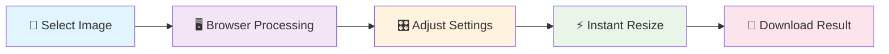
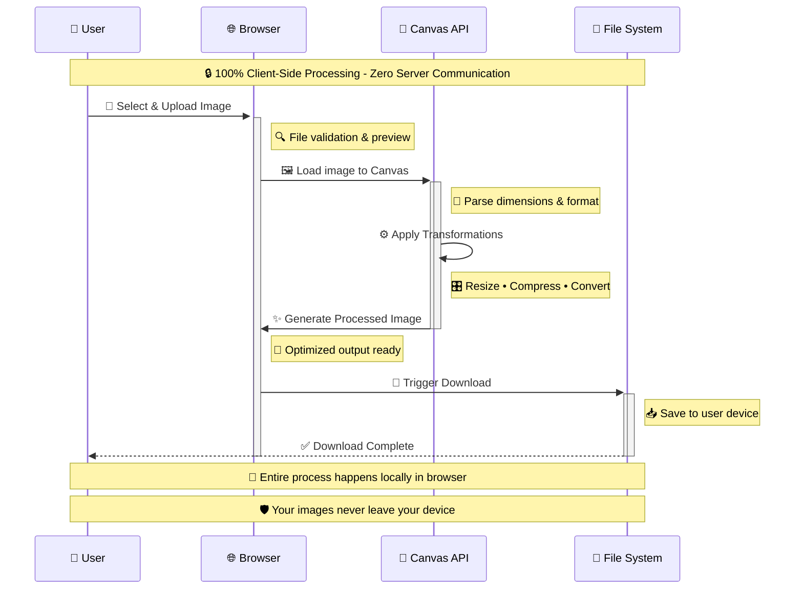
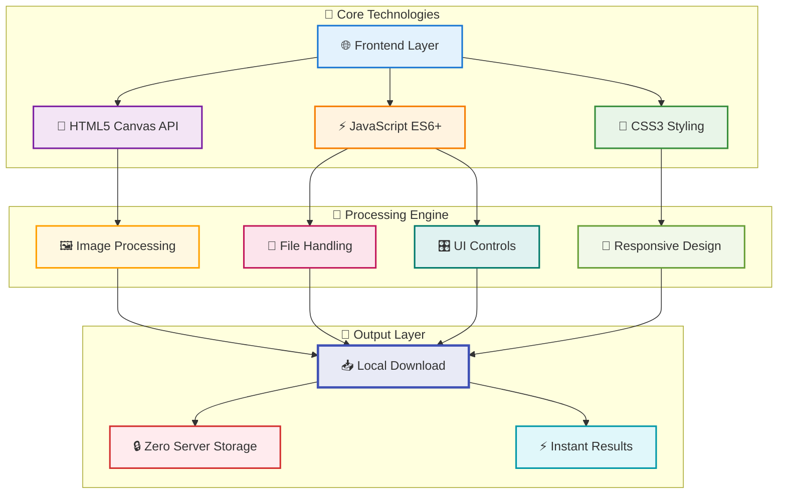
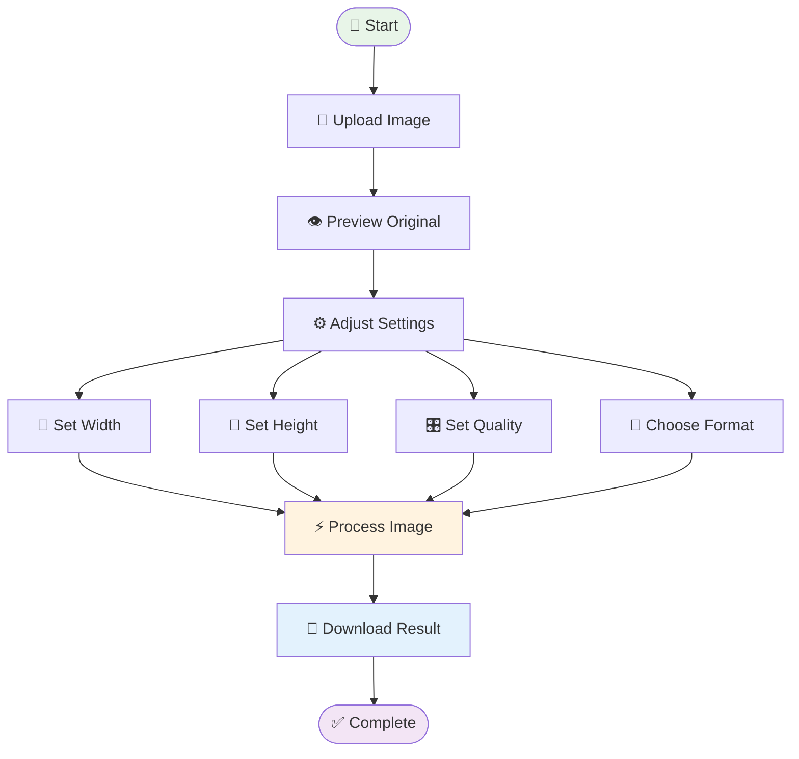
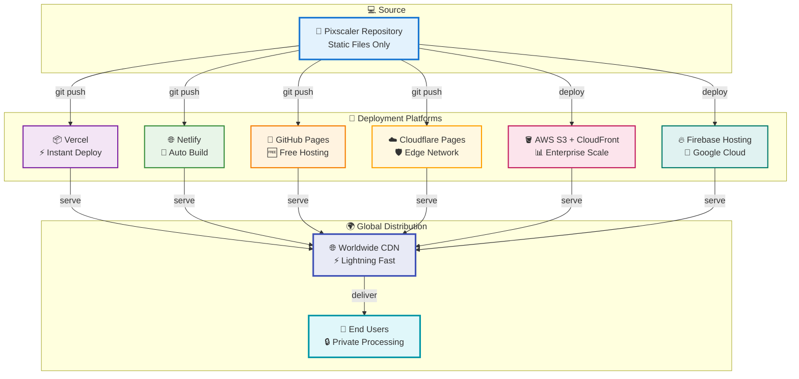
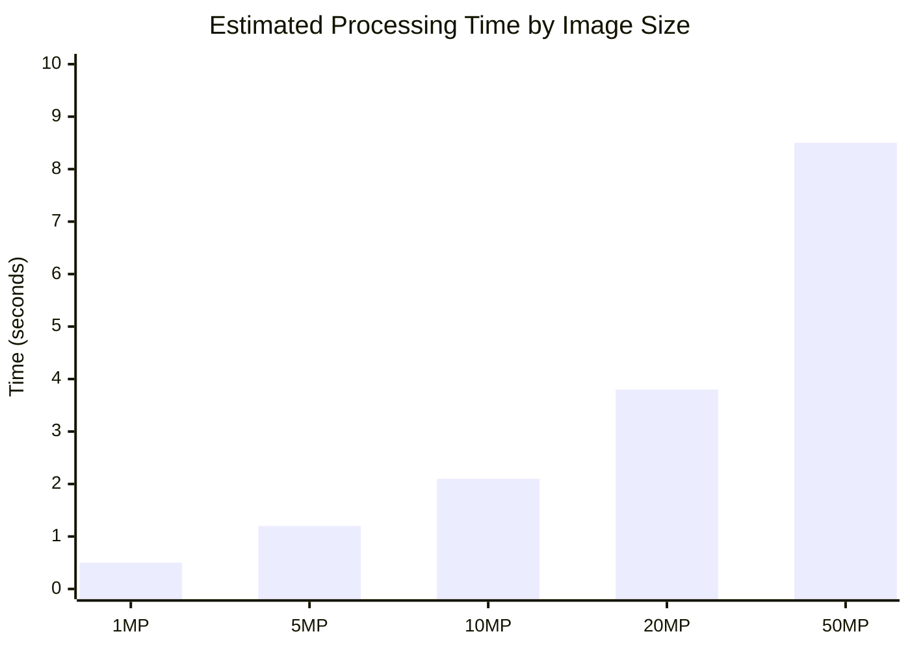
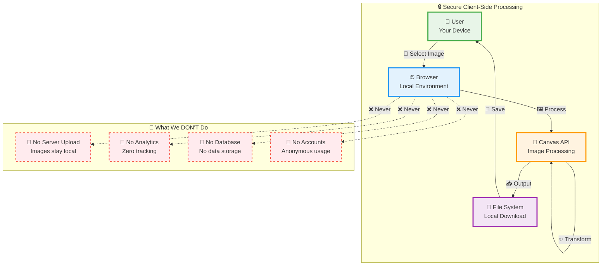

# 🖼️ Pixscaler - Professional Client-Side Image Resizer

<div align="center">


**Transform your images with professional precision - 100% free, forever!**

[](https://opensource.org/licenses/MIT)
[](https://github.com/27bhd/Pixscaler)
[](https://github.com/27bhd/Pixscaler)
[](https://github.com/27bhd/Pixscaler)

[📖 Documentation](#-documentation) • [💖 Support](#-support-the-project) • [🤝 Contributing](#-contributing)

</div>

---

## 🎯 What is Pixscaler?

Pixscaler is a **completely client-side image resizing tool** that processes your images locally in your browser. No uploads, no servers, no subscriptions - just pure image resizing magic powered by HTML5 Canvas API.

### 🔄 How It Works



## ✨ Features Overview

<table>
<tr>
<td width="50%">

### 🔒 **Privacy & Security**
- 🆓 **100% Free Forever** - No subscriptions, no paywalls
- 🔒 **Complete Privacy** - Images never leave your device
- 🚫 **No Registration** - Start using immediately
- 🛡️ **Zero Data Collection** - No tracking, no analytics

</td>
<td width="50%">

### ⚡ **Performance & Quality**
- ⚡ **Lightning Fast** - No upload delays, instant processing
- 🎯 **High Quality** - Professional-grade Canvas API
- 📏 **Unlimited File Sizes** - Process images of any size
- 🎛️ **Quality Control** - Adjustable compression settings

</td>
</tr>
<tr>
<td width="50%">

### 🌐 **Compatibility**
- 📱 **Works Everywhere** - Any modern browser, any device
- 🎨 **Multiple Formats** - JPEG, PNG, WebP support
- 🌍 **Works Offline** - Once loaded, no internet needed
- 📐 **Preset Dimensions** - Quick resize to common sizes

</td>
<td width="50%">

### 🚀 **Developer Friendly**
- 📦 **Static Deployment** - Deploy anywhere instantly
- 🔧 **Open Source** - MIT License, fully customizable
- 📊 **Zero Server Costs** - No backend infrastructure
- ♾️ **Unlimited Usage** - No rate limits or quotas

</td>
</tr>
</table>

## 🏗️ Architecture Overview

### Client-Side Processing Flow



### Technology Stack



## 🚀 Quick Start

### 1. **Instant Use** (Recommended)
Open the `public/index.html` file in your browser and start resizing immediately!

### 2. **Local Development**
```bash
# Clone the repository
git clone https://github.com/27bhd/Pixscaler.git
cd Pixscaler

# Serve locally (choose one)
python -m http.server 8000        # Python
npx serve .                       # Node.js
php -S localhost:8000            # PHP
```

Open `http://localhost:8000` in your browser.

## 🎛️ Usage Guide

### Basic Workflow



### Supported Operations

| Operation | Description | Formats |
|-----------|-------------|---------|
| 📏 **Resize** | Change image dimensions | JPEG, PNG, WebP |
| 🗜️ **Compress** | Reduce file size | JPEG, WebP |
| 🔄 **Convert** | Change image format | JPEG ↔ PNG ↔ WebP |
| 📐 **Preset Sizes** | Quick common dimensions | All formats |

## 🌐 Browser Compatibility

<div align="center">

| Browser | Version | Status |
|---------|---------|--------|
|  | 60+ | ✅ Full Support |
|  | 55+ | ✅ Full Support |
|  | 11+ | ✅ Full Support |
|  | 79+ | ✅ Full Support |
|  | Modern | ✅ Full Support |

</div>

## 🚀 Deployment Options

### Deployment Architecture



### Quick Deploy Commands

<details>
<summary>🔧 <strong>Vercel (Recommended)</strong></summary>

```bash
npm install -g vercel
vercel --prod
```
</details>

<details>
<summary>🌐 <strong>Netlify</strong></summary>

```bash
npm install -g netlify-cli
netlify deploy --prod --dir .
```
</details>

<details>
<summary>📄 <strong>GitHub Pages</strong></summary>

1. Push to GitHub repository
2. Go to Settings → Pages
3. Select source branch (main)
4. Your site will be live at `https://username.github.io/pixscaler`
</details>

## 📊 Performance Metrics

### Processing Performance

*Performance varies based on device capabilities and image complexity*



### Key Performance Indicators

| Metric | Value | Description |
|--------|-------|-------------|
| ⚡ **Processing Time** | Varies by device | Depends on image size and device performance |
| 📊 **File Size Support** | Browser dependent | Limited by available browser memory |
| 👥 **Concurrent Users** | N/A | Client-side only, no server |
| ⏱️ **Availability** | Offline capable | Works without internet once loaded |
| 🌍 **Compatibility** | Modern browsers | Chrome 60+, Firefox 55+, Safari 11+, Edge 79+ |

## 💖 Support the Project

<div align="center">

**Pixscaler is completely free with no ads or tracking.**  
*If this tool saves you time and sanity, consider supporting the developer:*

### ◎ Solana Donations

```
5Ap6T93SRLFj9Urg7SWk1As5nNDunb6zEzyw8fpSUuHo
```

</div>

| Amount | What It Buys | Impact |
|--------|--------------|--------|
| 0.01 SOL 🥤 | Soda money | Keeps the developer hydrated |
| 0.05 SOL ☕ | Coffee fuel | Powers late-night coding sessions |
| 0.1 SOL 🍕 | Pizza contribution | Fuels feature development |
| 0.25 SOL 🚀 | Major support | Enables significant improvements |

### 🌟 Other Ways to Support

<div align="center">

[](https://github.com/27bhd/Pixscaler)
[](https://twitter.com/intent/tweet?text=Check%20out%20Pixscaler%20-%20Free%20client-side%20image%20resizer!)
[](#)

</div>

## 🔧 Development

### Project Structure

```
Pixscaler/
├── 📁 public/                 # Main application
│   ├── 📄 index.html         # Main HTML file
│   ├── 📜 script.js          # Core JavaScript
│   ├── 🎨 style.css          # Styling
│   ├── 📱 site.webmanifest   # PWA manifest
│   └── 🖼️ favicon files      # Icons
├── 📁 legacy/                # Archived server code
├── 📄 package.json          # Dependencies
├── 📄 Procfile              # Deployment config
└── 📖 README.md             # This file
```

### Development Workflow

```mermaid
gitgraph
    commit id: "Initial Setup"
    branch feature
    checkout feature
    commit id: "Add Feature"
    commit id: "Test Feature"
    checkout main
    merge feature
    commit id: "Deploy to Production"
```

### Contributing Guidelines

1. **🍴 Fork** the repository
2. **🌿 Create** a feature branch (`git checkout -b feature/amazing-feature`)
3. **💻 Make** your changes
4. **✅ Test** thoroughly
5. **📝 Commit** your changes (`git commit -m 'Add amazing feature'`)
6. **🚀 Push** to the branch (`git push origin feature/amazing-feature`)
7. **🔄 Open** a Pull Request

## 📚 Documentation

### Code Structure

<details>
<summary>🔧 <strong>Main Files</strong></summary>

- `public/index.html` - Main application interface
- `public/script.js` - Image processing logic using Canvas API
- `public/style.css` - Application styling
- `public/site.webmanifest` - PWA configuration

</details>

<details>
<summary>🎛️ <strong>Key Features in Code</strong></summary>

- HTML5 Canvas API for image processing
- File drag & drop functionality
- Quality adjustment controls
- Format conversion (JPEG, PNG, WebP)
- Preset dimension buttons

</details>

## 🛡️ Security & Privacy

### Privacy-First Architecture



### Security Features

- ✅ **No Server Communication** - Images never leave your device
- ✅ **No Data Collection** - Zero tracking or analytics
- ✅ **No Account Required** - Anonymous usage
- ✅ **Open Source** - Transparent code
- ✅ **Client-Side Only** - No backend vulnerabilities

## 📈 Roadmap

### Current Version: v2.0
- ✅ Client-side image processing
- ✅ Multiple format support
- ✅ Quality controls
- ✅ Preset dimensions
- ✅ Mobile responsive design

### Upcoming Features
- 🔄 **Batch Processing** - Process multiple images
- 🎨 **Advanced Filters** - Blur, sharpen, brightness
- 📐 **Custom Crop** - Precise cropping tools
- 💾 **Offline Mode** - Full PWA capabilities
- 🌙 **Dark Mode** - Theme switching

## 📞 Contact & Support

<div align="center">

**Built with ❤️ by Beniverse**

[](https://github.com/27bhd)
[](https://github.com/27bhd/Pixscaler)

</div>

## 📄 License

```
MIT License

Copyright (c) 2024 Beniverse

Permission is hereby granted, free of charge, to any person obtaining a copy
of this software and associated documentation files (the "Software"), to deal
in the Software without restriction, including without limitation the rights
to use, copy, modify, merge, publish, distribute, sublicense, and/or sell
copies of the Software, and to permit persons to whom the Software is
furnished to do so, subject to the following conditions:

The above copyright notice and this permission notice shall be included in all
copies or substantial portions of the Software.

THE SOFTWARE IS PROVIDED "AS IS", WITHOUT WARRANTY OF ANY KIND, EXPRESS OR
IMPLIED, INCLUDING BUT NOT LIMITED TO THE WARRANTIES OF MERCHANTABILITY,
FITNESS FOR A PARTICULAR PURPOSE AND NONINFRINGEMENT. IN NO EVENT SHALL THE
AUTHORS OR COPYRIGHT HOLDERS BE LIABLE FOR ANY CLAIM, DAMAGES OR OTHER
LIABILITY, WHETHER IN AN ACTION OF CONTRACT, TORT OR OTHERWISE, ARISING FROM,
OUT OF OR IN CONNECTION WITH THE SOFTWARE OR THE USE OR OTHER DEALINGS IN THE
SOFTWARE.
```

---

<div align="center">

**Made with ❤️ and lots of ☕**

[](https://github.com/27bhd/Pixscaler)
[](https://github.com/27bhd/Pixscaler)
[](https://github.com/27bhd/Pixscaler)

*⭐ Star this repo if you find it useful!*

</div> 