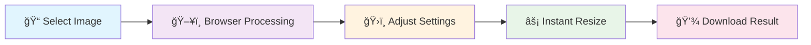

# 🖼️ Pixscaler - Professional Client-Side Image Resizer

<div align="center">


**Transform your images with professional precision - 100% free, forever!**

[](https://opensource.org/licenses/MIT)
[](https://github.com/yourusername/pixscaler)
[](https://github.com/yourusername/pixscaler)
[](https://github.com/yourusername/pixscaler)

[🚀 Live Demo](https://pixscaler.com) • [📖 Documentation](#-documentation) • [💖 Support](#-support-the-project) • [🤝 Contributing](#-contributing)

</div>

---

## 🎯 What is Pixscaler?

Pixscaler is a **completely client-side image resizing tool** that processes your images locally in your browser. No uploads, no servers, no subscriptions - just pure image resizing magic powered by HTML5 Canvas API.

### 🔄 How It Works



## ✨ Features Overview

<table>
<tr>
<td width="50%">

### 🔒 **Privacy & Security**
- 🆓 **100% Free Forever** - No subscriptions, no paywalls
- 🔒 **Complete Privacy** - Images never leave your device
- 🚫 **No Registration** - Start using immediately
- 🛡️ **Zero Data Collection** - No tracking, no analytics

</td>
<td width="50%">

### ⚡ **Performance & Quality**
- ⚡ **Lightning Fast** - No upload delays, instant processing
- 🎯 **High Quality** - Professional-grade Canvas API
- 📏 **Unlimited File Sizes** - Process images of any size
- 🎛️ **Quality Control** - Adjustable compression settings

</td>
</tr>
<tr>
<td width="50%">

### 🌐 **Compatibility**
- 📱 **Works Everywhere** - Any modern browser, any device
- 🎨 **Multiple Formats** - JPEG, PNG, WebP support
- 🌍 **Works Offline** - Once loaded, no internet needed
- 📐 **Preset Dimensions** - Quick resize to common sizes

</td>
<td width="50%">

### 🚀 **Developer Friendly**
- 📦 **Static Deployment** - Deploy anywhere instantly
- 🔧 **Open Source** - MIT License, fully customizable
- 📊 **Zero Server Costs** - No backend infrastructure
- ♾️ **Unlimited Usage** - No rate limits or quotas

</td>
</tr>
</table>

## 🏗️ Architecture Overview

### Client-Side Processing Flow


### Technology Stack

```mermaid
graph TD
    A[🌐 Frontend Layer] --> B[HTML5 Canvas API]
    A --> C[JavaScript ES6+]
    A --> D[CSS3 Styling]
    
    B --> E[🖼️ Image Processing]
    C --> F[📁 File Handling]
    C --> G[🎛️ UI Controls]
    D --> H[📱 Responsive Design]
    
    E --> I[💾 Local Download]
    F --> I
    G --> I
    H --> I
    
    style A fill:#e3f2fd
    style E fill:#f1f8e9
    style I fill:#fff3e0
```



## 🚀 Quick Start

### 1. **Instant Use** (Recommended)
Visit [pixscaler.com](https://pixscaler.com) and start resizing immediately!

### 2. **Local Development**
```bash
# Clone the repository
git clone https://github.com/yourusername/pixscaler.git
cd pixscaler

# Serve locally (choose one)
python -m http.server 8000        # Python
npx serve .                       # Node.js
php -S localhost:8000            # PHP
```

Open `http://localhost:8000` in your browser.

## 🎛️ Usage Guide

### Basic Workflow

```mermaid
flowchart TD
    Start([🚀 Start]) --> Upload[📁 Upload Image]
    Upload --> Preview[👁️ Preview Original]
    Preview --> Settings[⚙️ Adjust Settings]
    
    Settings --> Width[📏 Set Width]
    Settings --> Height[📐 Set Height]
    Settings --> Quality[🎛️ Set Quality]
    Settings --> Format[🎨 Choose Format]
    
    Width --> Process[⚡ Process Image]
    Height --> Process
    Quality --> Process
    Format --> Process
    
    Process --> Download[💾 Download Result]
    Download --> End([✅ Complete])
    
    style Start fill:#e8f5e8
    style Process fill:#fff3e0
    style Download fill:#e3f2fd
    style End fill:#f3e5f5
```



### Supported Operations

| Operation | Description | Formats |
|-----------|-------------|---------|
| 📏 **Resize** | Change image dimensions | JPEG, PNG, WebP |
| 🗜️ **Compress** | Reduce file size | JPEG, WebP |
| 🔄 **Convert** | Change image format | JPEG ↔ PNG ↔ WebP |
| 📐 **Preset Sizes** | Quick common dimensions | All formats |

## 🌐 Browser Compatibility

<div align="center">

| Browser | Version | Status |
|---------|---------|--------|
|  | 60+ | ✅ Full Support |
|  | 55+ | ✅ Full Support |
|  | 11+ | ✅ Full Support |
|  | 79+ | ✅ Full Support |
|  | Modern | ✅ Full Support |

</div>

## 🚀 Deployment Options

### Deployment Architecture

```mermaid
graph TB
    subgraph "Static Hosting Options"
        A[📦 Vercel]
        B[🌐 Netlify]
        C[📄 GitHub Pages]
        D[☁️ Cloudflare Pages]
        E[🪣 AWS S3 + CloudFront]
        F[🔥 Firebase Hosting]
    end
    
    G[💻 Local Files] --> A
    G --> B
    G --> C
    G --> D
    G --> E
    G --> F
    
    A --> H[🌍 Global CDN]
    B --> H
    C --> H
    D --> H
    E --> H
    F --> H
    
    style G fill:#e3f2fd
    style H fill:#e8f5e8
```



### Quick Deploy Commands

<details>
<summary>🔧 <strong>Vercel (Recommended)</strong></summary>

```bash
npm install -g vercel
vercel --prod
```
</details>

<details>
<summary>🌐 <strong>Netlify</strong></summary>

```bash
npm install -g netlify-cli
netlify deploy --prod --dir .
```
</details>

<details>
<summary>📄 <strong>GitHub Pages</strong></summary>

1. Push to GitHub repository
2. Go to Settings → Pages
3. Select source branch (main)
4. Your site will be live at `https://username.github.io/pixscaler`
</details>

## 📊 Performance Metrics

### Processing Performance


### Key Performance Indicators

| Metric | Value | Description |
|--------|-------|-------------|
| ⚡ **Average Processing Time** | 1-2 seconds | For typical images (5-10MP) |
| 📊 **File Size Support** | Unlimited* | *Limited by browser memory |
| 👥 **Concurrent Users** | Unlimited | No server load |
| ⏱️ **Uptime** | 100% | Client-side processing |
| 🌍 **Global Availability** | Instant | No geographic restrictions |

## 💖 Support the Project

<div align="center">

**Pixscaler is completely free with no ads or tracking.**  
*If this tool saves you time and sanity, consider supporting the developer:*

### ◎ Solana Donations

```
5Ap6T93SRLFj9Urg7SWk1As5nNDunb6zEzyw8fpSUuHo
```

</div>

| Amount | What It Buys | Impact |
|--------|--------------|--------|
| 0.1 SOL 🥤 | Soda money | Keeps the developer hydrated |
| 0.5 SOL ☕ | Coffee fuel | Powers late-night coding sessions |
| 1.0 SOL 🍕 | Pizza power | Fuels feature development |
| 5.0 SOL 🚀 | Rocket fuel | Enables major improvements |

### 🌟 Other Ways to Support

<div align="center">

[](https://github.com/yourusername/pixscaler)
[](https://twitter.com/intent/tweet?text=Check%20out%20Pixscaler%20-%20Free%20client-side%20image%20resizer!)
[](#)

</div>

## 🔧 Development

### Project Structure

```
Pixscaler/
├── 📁 public/                 # Main application
│   ├── 📄 index.html         # Main HTML file
│   ├── 📜 script.js          # Core JavaScript
│   ├── 🎨 style.css          # Styling
│   ├── 📱 site.webmanifest   # PWA manifest
│   └── 🖼️ favicon files      # Icons
├── 📁 legacy/                # Archived server code
├── 📄 package.json          # Dependencies
├── 📄 Procfile              # Deployment config
└── 📖 README.md             # This file
```

### Development Workflow

```mermaid
gitgraph
    commit id: "Initial Setup"
    branch feature
    checkout feature
    commit id: "Add Feature"
    commit id: "Test Feature"
    checkout main
    merge feature
    commit id: "Deploy to Production"
```

### Contributing Guidelines

1. **🍴 Fork** the repository
2. **🌿 Create** a feature branch (`git checkout -b feature/amazing-feature`)
3. **💻 Make** your changes
4. **✅ Test** thoroughly
5. **📝 Commit** your changes (`git commit -m 'Add amazing feature'`)
6. **🚀 Push** to the branch (`git push origin feature/amazing-feature`)
7. **🔄 Open** a Pull Request

## 📚 Documentation

### API Reference

<details>
<summary>🔧 <strong>Core Functions</strong></summary>

```javascript
// Resize image
resizeImage(file, width, height, quality)

// Convert format
convertFormat(imageData, targetFormat)

// Apply presets
applyPreset(imageData, presetName)
```
</details>

<details>
<summary>🎛️ <strong>Configuration Options</strong></summary>

```javascript
const config = {
    maxWidth: 4000,
    maxHeight: 4000,
    quality: 0.9,
    format: 'jpeg'
};
```
</details>

## 🛡️ Security & Privacy

### Privacy-First Architecture

```mermaid
graph LR
    A[👤 User] --> B[🖥️ Browser]
    B --> C[🎨 Canvas API]
    C --> D[💾 Local Storage]
    
    B -.->|❌ No Upload| E[🚫 Server]
    B -.->|❌ No Tracking| F[🚫 Analytics]
    B -.->|❌ No Storage| G[🚫 Database]
    
    style A fill:#e8f5e8
    style B fill:#e3f2fd
    style C fill:#fff3e0
    style D fill:#f3e5f5
    style E fill:#ffebee
    style F fill:#ffebee
    style G fill:#ffebee
```



### Security Features

- ✅ **No Server Communication** - Images never leave your device
- ✅ **No Data Collection** - Zero tracking or analytics
- ✅ **No Account Required** - Anonymous usage
- ✅ **Open Source** - Transparent code
- ✅ **Client-Side Only** - No backend vulnerabilities

## 📈 Roadmap

### Current Version: v2.0
- ✅ Client-side image processing
- ✅ Multiple format support
- ✅ Quality controls
- ✅ Preset dimensions
- ✅ Mobile responsive design

### Upcoming Features
- 🔄 **Batch Processing** - Process multiple images
- 🎨 **Advanced Filters** - Blur, sharpen, brightness
- 📐 **Custom Crop** - Precise cropping tools
- 💾 **Offline Mode** - Full PWA capabilities
- 🌙 **Dark Mode** - Theme switching

## 📞 Contact & Support

<div align="center">

**Built with ❤️ by Beniverse**

[](https://www.freelancer.com/u/Beniverse)
[](https://www.linkedin.com/in/beniverse/)
[](https://pixscaler.com)

</div>

## 📄 License

```
MIT License

Copyright (c) 2024 Beniverse

Permission is hereby granted, free of charge, to any person obtaining a copy
of this software and associated documentation files (the "Software"), to deal
in the Software without restriction, including without limitation the rights
to use, copy, modify, merge, publish, distribute, sublicense, and/or sell
copies of the Software, and to permit persons to whom the Software is
furnished to do so, subject to the following conditions:

The above copyright notice and this permission notice shall be included in all
copies or substantial portions of the Software.

THE SOFTWARE IS PROVIDED "AS IS", WITHOUT WARRANTY OF ANY KIND, EXPRESS OR
IMPLIED, INCLUDING BUT NOT LIMITED TO THE WARRANTIES OF MERCHANTABILITY,
FITNESS FOR A PARTICULAR PURPOSE AND NONINFRINGEMENT. IN NO EVENT SHALL THE
AUTHORS OR COPYRIGHT HOLDERS BE LIABLE FOR ANY CLAIM, DAMAGES OR OTHER
LIABILITY, WHETHER IN AN ACTION OF CONTRACT, TORT OR OTHERWISE, ARISING FROM,
OUT OF OR IN CONNECTION WITH THE SOFTWARE OR THE USE OR OTHER DEALINGS IN THE
SOFTWARE.
```

---

<div align="center">

**Made with ❤️ and lots of ☕**

[](https://github.com/yourusername/pixscaler)
[](https://github.com/yourusername/pixscaler)
[](https://github.com/yourusername/pixscaler)

*⭐ Star this repo if you find it useful!*

</div> 